# Food App 📱🍔

[](https://opensource.org/licenses/MIT)
[](https://expo.dev)
[](https://reactnative.dev)
[](https://strapi.io)

**Food App**, Lider yemek sipariş platformlarından ilham alarak geliştirdiğim React Native ve Expo tabanlı modern bir mobil yemek sipariş uygulaması. Firebase'in güçlü backend hizmetleriyle entegre olarak dinamik restoran ve menü yönetimi, kullanıcı kimlik doğrulama ve adres yönetimi gibi temel modülleri hayata geçirdim. NativeWind ile duyarlı ve modern bir kullanıcı arayüzü tasarlayıp Expo Router ile akıcı bir navigasyon deneyimi sağladım. Bu proje, kapsamlı arama ve dinamik veri yönetimi yetkinliklerimi sergilemektedir.

## 🎯 Özellikler

- **Dinamik Restoran ve Mutfak Türü Listeleme**: Firebase Firestore veya Realtime Database gibi servisler aracılığıyla dinamik olarak çekilen restoranlar, mutfak türleri ve menü öğeleri, kullanıcılara zengin bir seçim yelpazesi sunar.
- **Kullanıcı Odaklı Sipariş ve Favori Yönetimi**: Kullanıcıların kolayca sipariş oluşturmasını, favori restoranlarını veya menü öğelerini kaydetmesini sağlar. Bu veriler de Firebase üzerinde yönetilir.
- **Kullanıcı Kimlik Doğrulama ve Profil Yönetimi**: Firebase Authentication ile entegre kullanıcı giriş/kayıt ve profil bilgilerinin yönetimi (`useLogin`, `useRegister`, `useUser` hook'ları ile sağlanır. `FirebaseAuthProvider.tsx` bu entegrasyonun temelini oluşturur).
- **Adres Yönetimi**: Kullanıcıların birden fazla adres eklemesini, düzenlemesini ve harita üzerinde görüntülemesini sağlar. Bu adres verileri Firebase'de saklanır.
- **Merkezi Firebase Entegrasyonu ve Veri Yönetimi**: Özel React Hook'ları (`useAddresses`, `useCategories`, `useRestaurants` vb.) Firebase servisleriyle etkileşim için tasarlanmıştır. Bu sayede veri çekme ve yönetimi tutarlı ve merkezi bir şekilde yapılır.
- **Akıcı ve Modern Kullanıcı Arayüzü**: NativeWind v4 ile Tailwind CSS tabanlı, modern ve duyarlı bir kullanıcı arayüzü sunar.
- **Akıcı Navigasyon**: Expo Router ile güçlendirilmiş, sekmeli (tab-based) ve dosya tabanlı navigasyon sayesinde akıcı bir kullanıcı deneyimi sağlar. Özellikle arama sekmesi gibi özel durumlar için gizli tab bar kullanımı dikkat çekicidir.
- **Durum Yönetimi**: Sepet `CartContext`, Adres `AddressContext` ve Firebase Kimlik Doğrulama FirebaseAuthProvider için merkezi durum yönetimi sağlayarak, uygulamanın farklı bölümlerinde verilere kolay erişim ve tutarlılık sunar.
- **Dinamik Sayfa Yönlendirme**: Expo Router'ın dinamik rota (`[addressId].tsx`, `[cuisinesId].tsx`) yetenekleri sayesinde adres detayları, mutfak türleri ve restoran detayları gibi sayfalar dinamik olarak oluşturulur.
  Ikonlar: Ionicons ile zenginleştirilmiş kullanıcı deneyimi.

## 🛠️ Teknoloji

| Teknoloji         | Sürüm  | Açıklama                                        |
| ----------------- | ------ | ----------------------------------------------- |
| React Native      | 0.76.0 | Mobil uygulama çerçevesi                        |
| Expo              | 53.0.0 | Geliştirme ve dağıtım platformu                 |
| NativeWind        | 4.0.0  | Tailwind CSS tabanlı stil                       |
| Expo Router       | 5.0.7  | Dosya tabanlı navigasyon                        |
| Firebase          | v9     | Backend (Authentication, Firestore/Realtime DB) |
| Expo Vector Icons | 14.0.0 | (Ionicons)                                      |
| React             | 19.0.0 | UI kütüphanesi                                  |

## 📁 Dosya Yapısı

```bash
food-app/
📦src                               # Uygulamanın ana kaynak kodu dizini
 ┣ 📂app                            # Expo Router tarafından yönetilen uygulama sayfaları ve navigasyon yapısı
 ┃ ┣ 📂(tabs)                       # Uygulamanın alt kısmında sekmeli navigasyonu (tab bar) içeren grup
 ┃ ┃ ┣ 📂account                    # Hesap ile ilgili sayfaları içeren tab
 ┃ ┃ ┃ ┣ 📂address                  # Kullanıcının adres bilgilerini yönettiği sayfalar
 ┃ ┃ ┃ ┃ ┣ 📜add.tsx                # Yeni adres ekleme sayfası
 ┃ ┃ ┃ ┃ ┣ 📜address.tsx            # Kayıtlı adresleri listeleme veya yönetme sayfası
 ┃ ┃ ┃ ┃ ┗ 📜[addressId].tsx        # Belirli bir adresin detaylarını veya düzenleme sayfası
 ┃ ┃ ┃ ┣ 📂auth                     # Kimlik doğrulama (giriş/kayıt) sayfaları
 ┃ ┃ ┃ ┃ ┣ 📜login.tsx              # Kullanıcı giriş sayfası
 ┃ ┃ ┃ ┃ ┗ 📜register.tsx           # Yeni kullanıcı kayıt sayfası
 ┃ ┃ ┃ ┣ 📜account-details.tsx      # Kullanıcı hesap detaylarını gösteren sayfa
 ┃ ┃ ┃ ┣ 📜favorites.tsx            # Favori öğelerin listelendiği sayfa
 ┃ ┃ ┃ ┣ 📜index.tsx                # Hesap tabının ana sayfası
 ┃ ┃ ┃ ┣ 📜more.tsx                 # Ek seçenekler veya ayarlar sayfası
 ┃ ┃ ┃ ┣ 📜offers.tsx               # Kullanıcıya özel tekliflerin gösterildiği sayfa
 ┃ ┃ ┃ ┣ 📜vouchers.tsx             # Kullanıcının sahip olduğu veya kullanabileceği kuponların sayfası
 ┃ ┃ ┃ ┗ 📜_layout.tsx              # Hesap tabının düzen dosyası
 ┃ ┃ ┣ 📂home                       # Ana sayfa ve ilgili içerikleri barındıran tab
 ┃ ┃ ┃ ┣ 📂cuisines                 # Mutfak türleri ile ilgili sayfalar
 ┃ ┃ ┃ ┃ ┣ 📜cuisines-list.tsx      # Mutfak türlerinin listelendiği sayfa
 ┃ ┃ ┃ ┃ ┣ 📜cuisines.tsx           # Mutfak türleri genel sayfası
 ┃ ┃ ┃ ┃ ┗ 📜[cuisinesId].tsx       # Belirli bir mutfak türüne ait detay veya listeleme sayfası
 ┃ ┃ ┃ ┣ 📜index.tsx                # Ana sayfa bileşeni
 ┃ ┃ ┃ ┣ 📜restaurant-details.tsx   # Restoran detay sayfası
 ┃ ┃ ┃ ┗ 📜_layout.tsx              # Ana sayfa tabının düzen dosyası
 ┃ ┃ ┣ 📜cart.tsx                   # Sepet sayfası
 ┃ ┃ ┣ 📜orders.tsx                 # Kullanıcının sipariş geçmişini gösteren sayfa
 ┃ ┃ ┣ 📜search.tsx                 # Arama sayfası
 ┃ ┃ ┗ 📜_layout.tsx                # (tabs) navigasyonunun ana düzen dosyası
 ┃ ┗ 📜_layout.tsx                  # Genel uygulama düzenini ve router'ı tanımlayan dosya
 ┣ 📂components                     # Yeniden kullanılabilir UI bileşenleri
 ┃ ┣ 📂features                     # Belirli bir özelliğe ait daha karmaşık bileşenler
 ┃ ┃ ┣ 📂address                    # Adres yönetimi ile ilgili bileşenler
 ┃ ┃ ┃ ┣ 📜AddAddressForm.tsx       # Adres ekleme formu bileşeni
 ┃ ┃ ┃ ┣ 📜AddressCard.tsx          # Bir adresi gösteren kart bileşeni
 ┃ ┃ ┃ ┣ 📜AddressList.tsx          # Adres listeleme bileşeni
 ┃ ┃ ┃ ┣ 📜AddressMap.tsx           # Adres konumunu gösteren harita bileşeni
 ┃ ┃ ┃ ┗ 📜EditAddressForm.tsx      # Adres düzenleme formu bileşeni
 ┃ ┃ ┣ 📂orders                     # Siparişlerle ilgili bileşenler
 ┃ ┃ ┃ ┣ 📜OrderCard.tsx            # Bir siparişi gösteren kart bileşeni
 ┃ ┃ ┃ ┣ 📜OrderItems.tsx           # Siparişin içeriğindeki ürünleri gösteren bileşen
 ┃ ┃ ┃ ┗ 📜OrderList.tsx            # Siparişleri listeleme bileşeni
 ┃ ┃ ┗ 📂restaurants                # Restoranlarla ilgili bileşenler
 ┃ ┃ ┃ ┗ 📜RestaurantList.tsx       # Restoranları listeleme bileşeni
 ┃ ┣ 📂layout                       # Uygulamanın genel düzeniyle ilgili bileşenler (header, footer vb.)
 ┃ ┃ ┗ 📜Header.tsx                 # Başlık (header) bileşeni
 ┃ ┣ 📂ui                           # Temel UI elemanları (buton, input vb.)
 ┃ ┃ ┣ 📜DateInput.tsx              # Tarih giriş bileşeni
 ┃ ┃ ┣ 📜ErrorMessage.tsx           # Hata mesajı gösterme bileşeni
 ┃ ┃ ┣ 📜Loader.tsx                 # Yükleme (loading) göstergesi bileşeni
 ┃ ┃ ┣ 📜PhoneInput.tsx             # Telefon numarası giriş bileşeni
 ┃ ┃ ┗ 📜TextInputField.tsx         # Genel metin giriş alanı bileşeni
 ┃ ┣ 📜CategoryList.tsx             # Kategori listesi bileşeni
 ┃ ┗ 📜CuisinesList.tsx             # Mutfak türleri listesi bileşeni
 ┣ 📂context                        # Uygulama genelinde paylaşılan verileri yöneten React Context'ler
 ┃ ┣ 📜AddressContext.tsx           # Adres verilerini yöneten Context
 ┃ ┣ 📜CartContext.tsx              # Sepet verilerini yöneten Context
 ┃ ┗ 📜FirebaseAuthProvider.tsx     # Firebase kimlik doğrulama durumunu sağlayan Context
 ┣ 📂hooks                          # Özel React Hook'ları (veri çekme, durum yönetimi vb.)
 ┃ ┣ 📜useAddresses.ts              # Adres verilerini çekmek ve yönetmek için hook
 ┃ ┣ 📜useCategories.ts             # Kategorileri çekmek için hook
 ┃ ┣ 📜useFavoriteRestaurants.ts    # Favori restoranları yönetmek için hook
 ┃ ┣ 📜useFavorites.ts              # Genel favori öğeleri yönetmek için hook
 ┃ ┣ 📜useLogin.ts                  # Kullanıcı girişi işlemleri için hook
 ┃ ┣ 📜useLogout.ts                 # Kullanıcı çıkışı işlemleri için hook
 ┃ ┣ 📜useMenuItems.ts              # Menü öğelerini çekmek için hook
 ┃ ┣ 📜useOrders.ts                 # Sipariş verilerini çekmek ve yönetmek için hook
 ┃ ┣ 📜useRegister.ts               # Kullanıcı kayıt işlemleri için hook
 ┃ ┣ 📜useRestaurantDetails.ts      # Restoran detaylarını çekmek için hook
 ┃ ┣ 📜useRestaurants.ts            # Restoran verilerini çekmek için hook
 ┃ ┗ 📜useUser.ts                   # Kullanıcı bilgilerini yönetmek için hook
 ┣ 📂screens                        # Ekran bileşenleri
 ┃ ┣ 📜AccountScreen.tsx            # Hesap ekranı bileşeni
 ┃ ┣ 📜LoginScreen.tsx              # Giriş ekranı bileşeni
 ┃ ┗ 📜RegisterScreen.tsx           # Kayıt ekranı bileşeni
 ┣ 📂services                       # API çağrıları ve harici servislerle etkileşim mantığı
 ┃ ┣ 📂auth                         # Kimlik doğrulama servisleri
 ┃ ┃ ┣ 📜login.ts                   # Giriş API çağrısı
 ┃ ┃ ┗ 📜logout.ts                  # Çıkış API çağrısı
 ┃ ┣ 📂user                         # Kullanıcı ile ilgili servisler
 ┃ ┃ ┣ 📜profile.ts                 # Kullanıcı profili API çağrıları
 ┃ ┃ ┗ 📜register.ts                # Kullanıcı kayıt API çağrısı
 ┃ ┗ 📜firebaseConfig.ts            # Firebase yapılandırma dosyası
 ┣ 📂types                          # TypeScript tür tanımları
 ┃ ┣ 📜category.ts                  # Kategori veri yapısı tanımı
 ┃ ┣ 📜env.d.ts                     # Ortam değişkenleri için tür tanımları
 ┃ ┣ 📜firebaseContext.ts           # Firebase Context'i için tür tanımları
 ┃ ┣ 📜menuItem.ts                  # Menü öğesi veri yapısı tanımı
 ┃ ┣ 📜order.ts                     # Sipariş veri yapısı tanımı
 ┃ ┣ 📜restaurant.ts                # Restoran veri yapısı tanımı
 ┃ ┗ 📜user.ts                      # Kullanıcı veri yapısı tanımı
 ┣ 📂assets                         # Statik dosyalar (resimler, fontlar vb.)
```

## 📸 Uygulamanın Ana Görüntüleri

| Keşfet                                                   | Arama                                                   | Sepet                                                   |
| -------------------------------------------------------- | ------------------------------------------------------- | ------------------------------------------------------- |
| 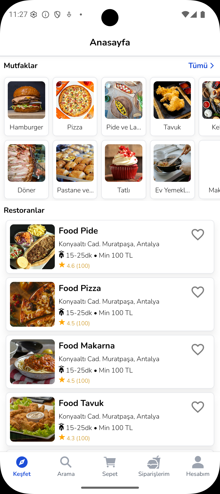 |  | 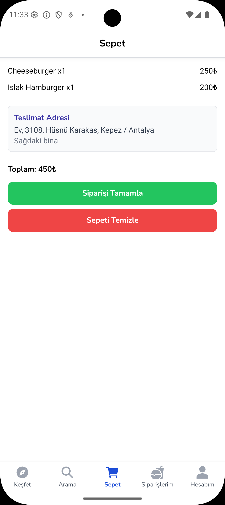 |

| Siparişlerim                                                   | Hesabım                                                  |
| -------------------------------------------------------------- | -------------------------------------------------------- |
| 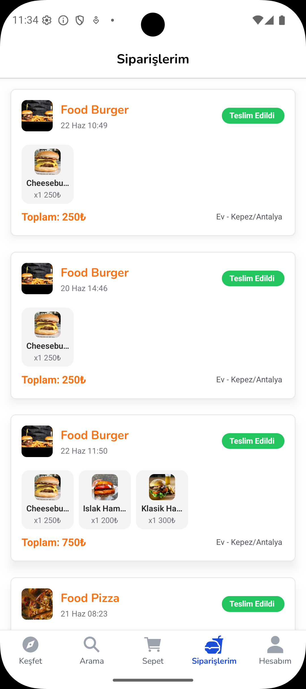 |  |

## 📸 Keşfet Sayfası Görüntüleri

| index.tsx                                                | cuisines.tsx                                                | cuisines-list.tsx                                                 |
| -------------------------------------------------------- | ----------------------------------------------------------- | ----------------------------------------------------------------- |
|  |  |  |

| [cuisinesId].tsx                                                 | restaurant-details.tsx                                           |
| ---------------------------------------------------------------- | ---------------------------------------------------------------- |
| 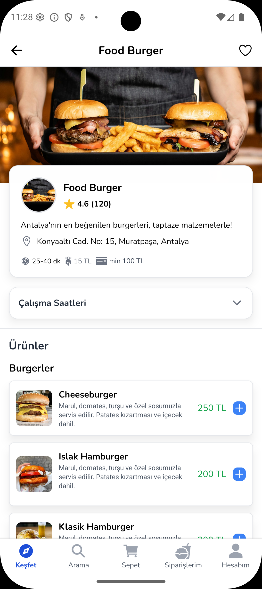 |  |

## 📸 Diğer Ekran Görüntüleri

| Hesab Detayları                                                   | Favoriler                                                   | Adreslerim                                                   |
| ----------------------------------------------------------------- | ----------------------------------------------------------- | ------------------------------------------------------------ |
| 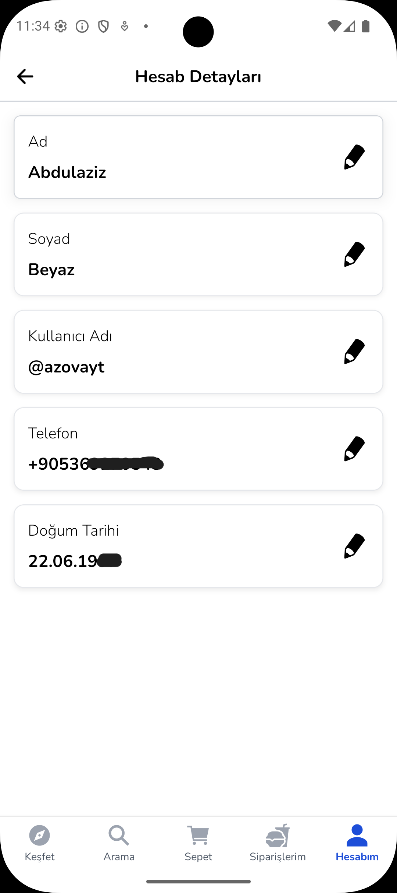 | 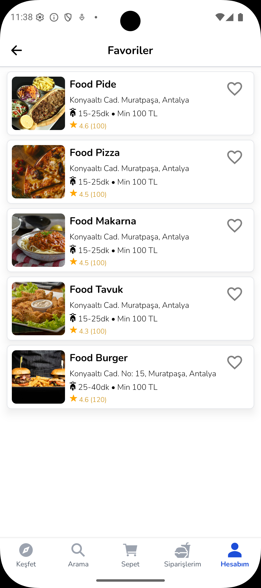 | 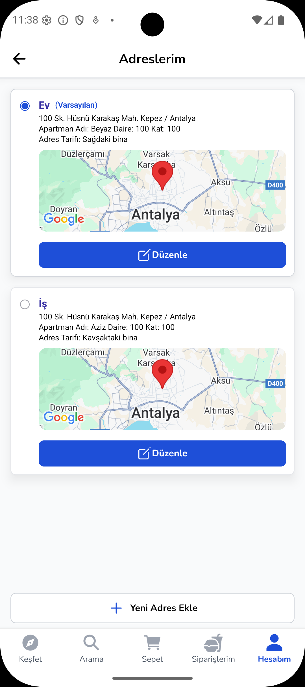 |

| Adres Düzenle                                                   | Adres Ekle                                                   | Sipariş Kaydedildi                                                   |
| --------------------------------------------------------------- | ------------------------------------------------------------ | -------------------------------------------------------------------- |
| 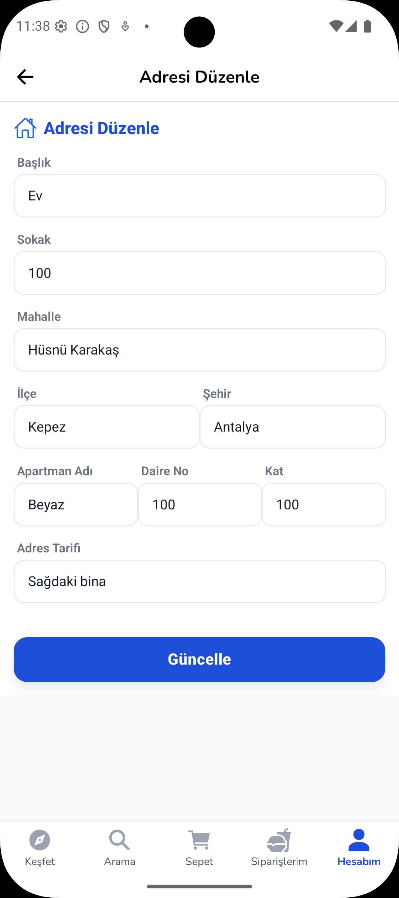 | 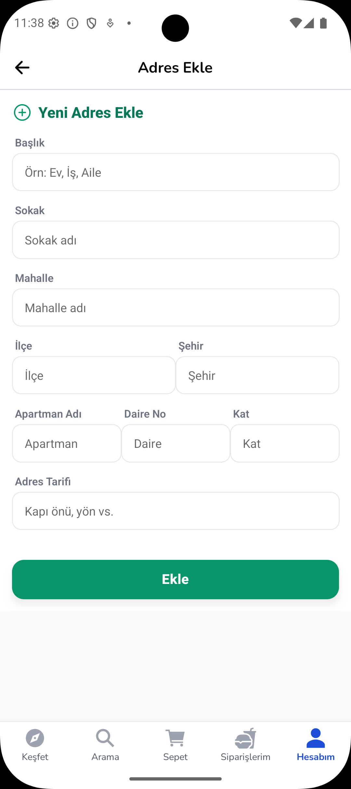 | 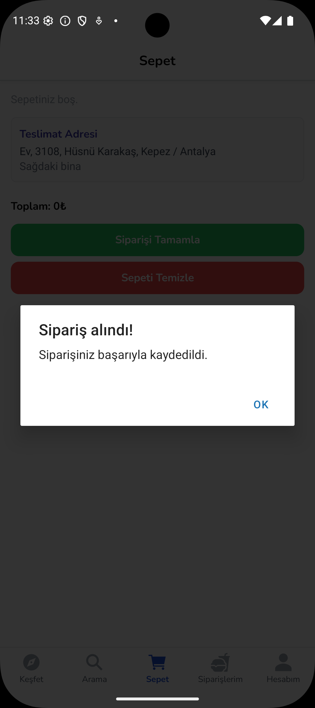 |

| Giris Yap                                                   | Kayıt Ol                                                   |
| ----------------------------------------------------------- | ---------------------------------------------------------- |
| 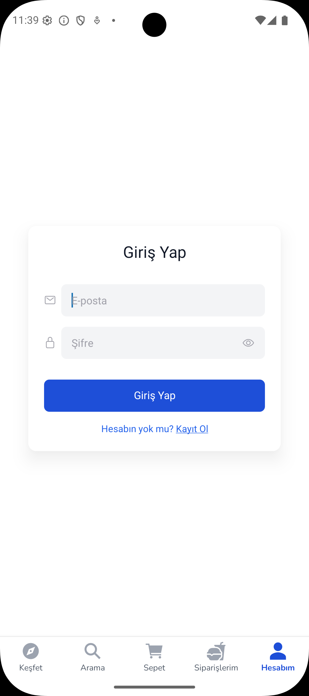 | 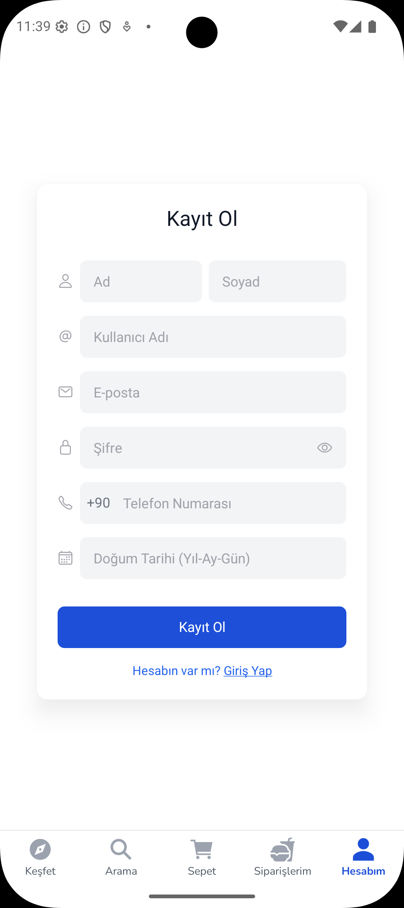 |
